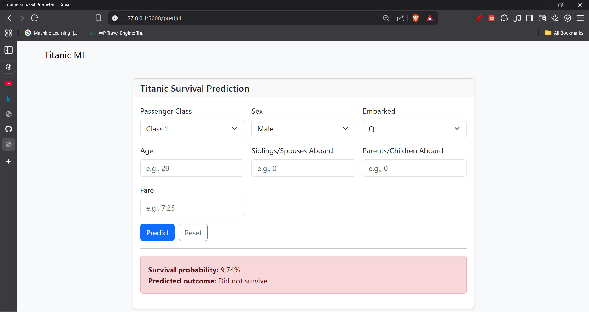

## Titanic ML - Flask App



### Quick start

```bash
pip install -r requirements.txt
python -m model.train  # optional: pretrain; otherwise app will train on first run
python app.py
```

Open http://127.0.0.1:5000

### Tech
- Flask + Bootstrap UI
- scikit-learn Random Forest with preprocessing
  - Separate OneHotEncoder per categorical feature (`sex`, `embarked`)
- Artifacts: `model/artifacts/model.joblib`, `model/artifacts/schema.json`
- Val accuracy ~0.82 (train/test split)

### Deploy to Render (free)
1. Push this repo to GitHub.
2. On Render, create a new Web Service from this repo.
   - Build command: `pip install -r requirements.txt`
   - Start command: `gunicorn app:app --workers 2 --threads 4 --timeout 120`
   - Or use `render.yaml` in this repo for auto-detect.
3. After deploy, use the Render URL for your README/resume demo link.

### Resume-ready snippet
Built a Flask + Bootstrap app to predict Titanic survival with a scikit-learn Random Forest (separate per-feature encoders, persisted pipeline); achieved ~82% validation accuracy; deployed on Render. [Code] [Live Demo]

### Run tests manually
- Not applicable; simple E2E: start app and submit form to see probability.
